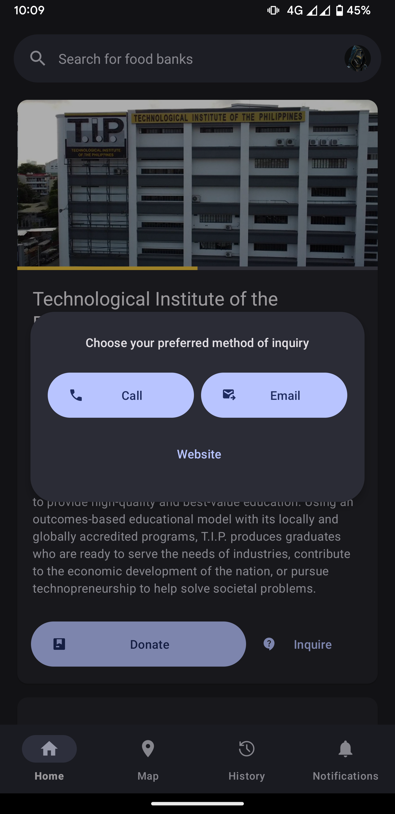
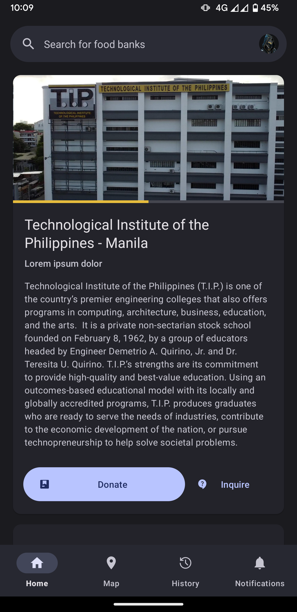
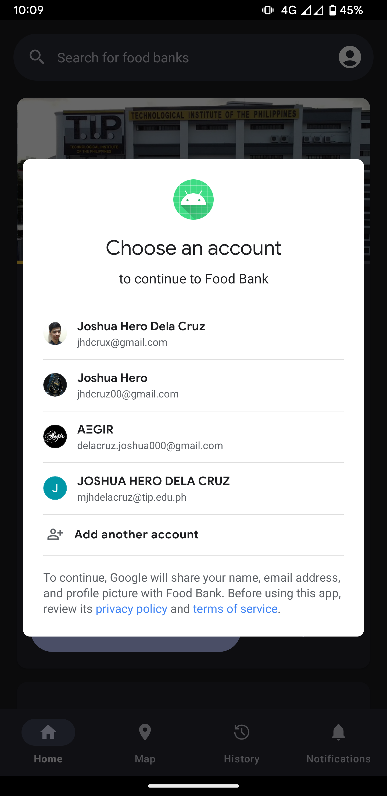
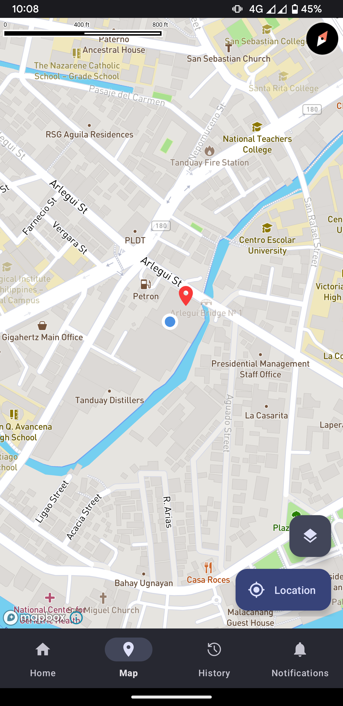
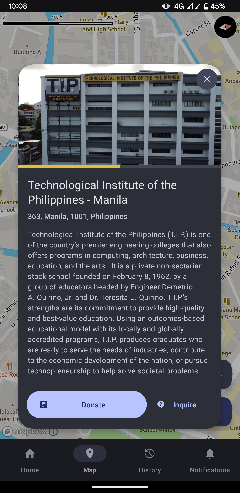
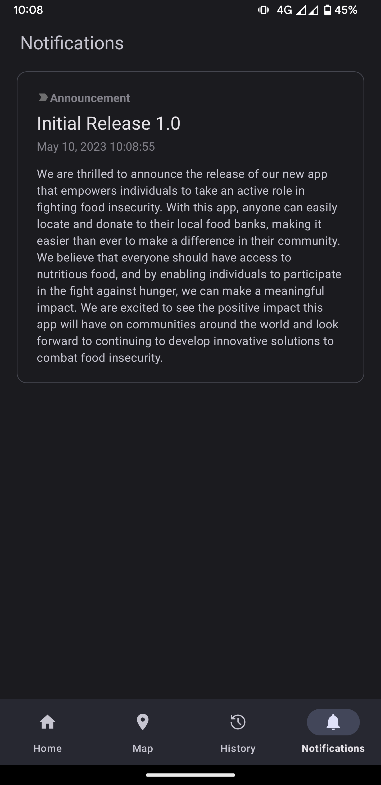

# Food Bank

A simple food bank application that allows users to donate food to the food bank.

## Features

- Listing and viewing of available food banks and their details
- Integration with Mapbox SDK for interactive viewing of food banks
- Send food donations offers
- Track your food donations

## Screenshots

<p align="center">







</p>

## Infrastructure

This project integrates several tooling and libraries.

### Development Integrations & Tooling

- Qodana
- Github Actions
- Detekt
- Trunk.io

### Libraries

- Mapbox Android SDK
- Material 3
- Coil
- Firebase
    - Firestore
    - Crashlytics
    - Performance
    - Authentication

## Development

### Setting up Mapbox API

> https://account.mapbox.com/access-tokens/ | https://docs.mapbox.com/android/maps/guides/install/

- A public access token: From your account's tokens page, you can either copy your default public
  token or click the Create a token button to create a new public token.

- A secret access token with the `Downloads:Read` scope.
    - From your account's tokens page, click the Create a token button.
    - From the token creation page, give your token a name and make sure the box next to the
      `Downloads:Read` scope is checked.
    - Click the Create token button at the bottom of the page to create your token.
    - The token you've created is a secret token, which means you will only have one opportunity to
      copy it somewhere secure.

#### Configure your secret token

To avoid exposing your secret token, add it as an environment variable:

Find or create a gradle.properties file in your Gradle user home folder. The folder can be found at
`«USER_HOME»/.gradle`.

Once you have found or created the file, its path should be
`«USER_HOME»/.gradle/gradle.properties`. You can read more about Gradle properties in the official
Gradle documentation.

Add your secret token your `«USER_HOME»/.gradle/gradle.properties` file:

```dotenv
mapboxPassword=YOUR_SECRET_MAPBOX_ACCESS_TOKEN
```

#### Configure your public token

open the project's `values/dev.xml` file and add the following string resource, replacing
`YOUR_MAPBOX_ACCESS_TOKEN` with your public Mapbox API token:

```xml
<!-- ... -->
<string name="mapbox_access_token">YOUR_MAPBOX_ACCESS_TOKEN</string>
```

If you ever need
to [rotate your access token](https://docs.mapbox.com/help/how-mapbox-works/access-tokens/), you
will need to update the token value in your
R.strings.xml file.

### Setting up firebase

**Uses:**

- Firestore
- Crashlytics
- Performance

Download `google-services.json` from firebase console's project settings, and copy it the the
project directory

### Setting up Google Sign-In

#### Debug

Get `SHA-1` and `SHA-256` fingerprints using the ff. command

```sh
./gradlew signingReport  # look for AndroidDebugTest section
```

Add both the fingerprints in firebase console's project settings right
below where `google-services.json` is located.

>
Resource: [https://developers.google.com/android/guides/client-auth#self-signing_your_application](https://developers.google.com/android/guides/client-auth#self-signing_your_application)

## License

This projects is distributed under the MIT license. See [LICENSE](./LICENSE.txt) for more
information.
